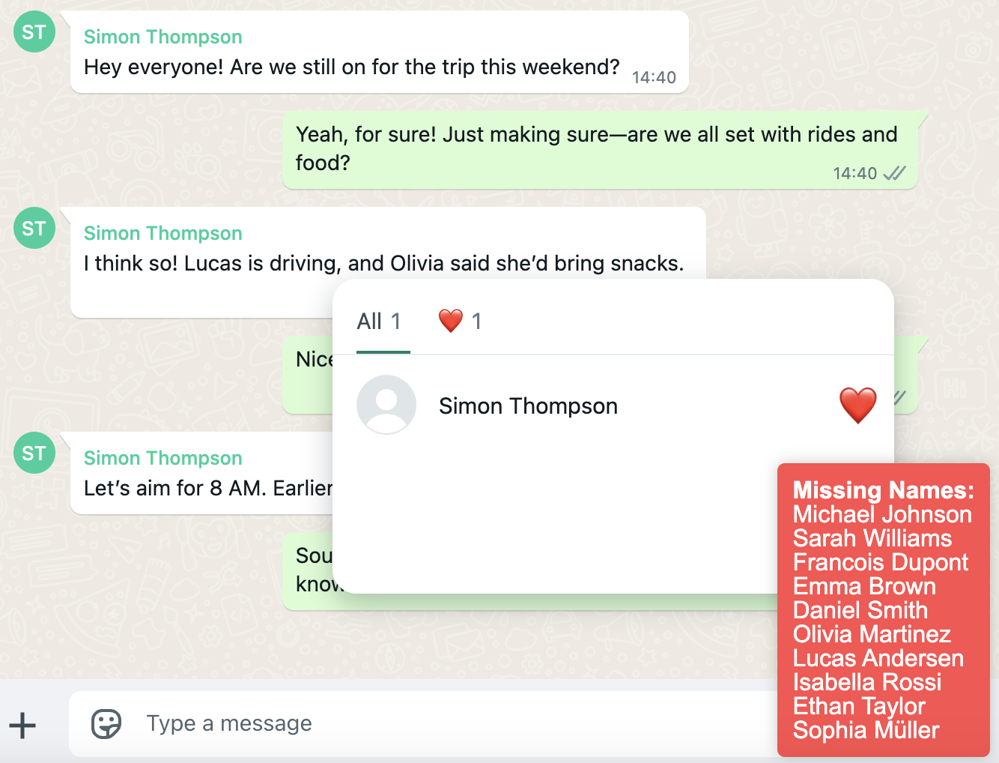
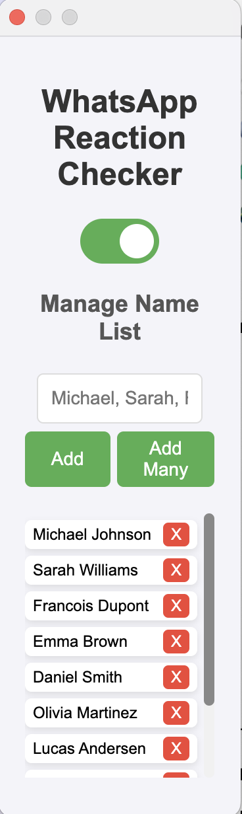
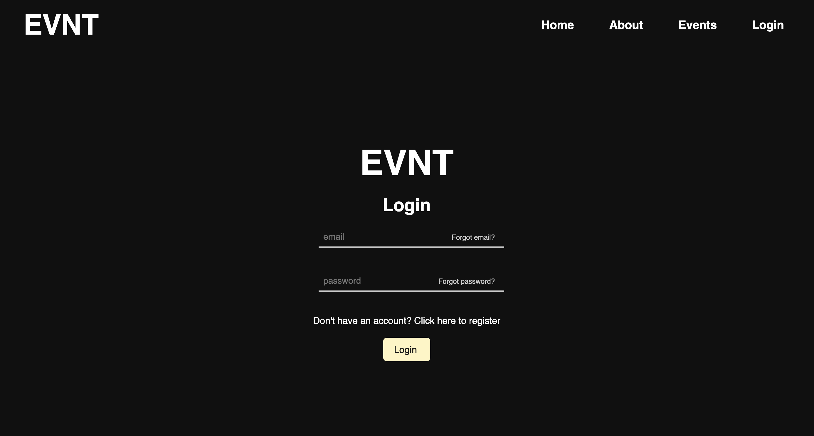
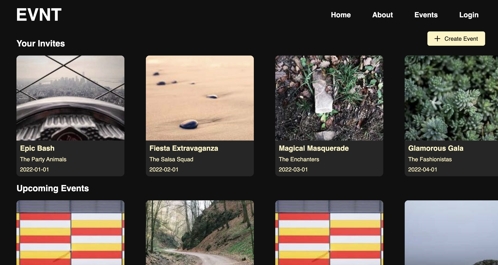

# Jonathan Ouwerx

I'm a Mathematics and Computer Science student at Duke University interested in software engineering and entrepreneurship. I love working on coding projects—big or small—even if I spend 20 hours building a tool to save me 2 minutes per week. I am Belgian, Danish, and British, and I hope to work in the US!

---

## Languages and Tools

  
  
  
  
  
  
  
  
  
  

## Projects

### WhatsApp Reaction Checker 
A Chrome extension that identifies which users have reacted to a WhatsApp message and highlights those who haven't from a predefined list.

More Details
 
 
  
#### Key Features
- **Toggle Extension**: Easily enable or disable the extension via a popup switch.  
- **Manage Name List**: Add, remove, and manage a list of names directly from the popup.  
- **Real-time Reaction Check**: Automatically scrolls through reactions and identifies missing names.  
- **Persistent State**: Saves and loads the extension state and name list across sessions.

#### Tech Stack
- **Languages**: JavaScript, HTML, CSS  
- **APIs**: Chrome Extensions API

#### Screenshots

    
    

---

###  Jump CLI Tool
A command line application to jump to predetermined points in the terminal, making navigation faster and more efficient.

Demo: https://jump-demo-nine.vercel.app/

More Details

#### Key Features
- **Add Destinations**: Easily add new destinations with the `jump add <name>` command.  
- **Navigate to Destinations**: Quickly navigate to preset directories using the `jump to <name>` command.  
- **List Destinations**: View all saved destinations with the `jump list` command.  
- **Remove Destinations**: Remove specific or all destinations using the `jump rm <name>` command.

#### Tech Stack
- **Language**: V  
- **Libraries**: cli, os, v.vmod

---

### Online Jump CLI Demo

A demo showcasing how the Jump CLI tool can manage and navigate project directories efficiently in a browser environment.

Demo: https://jump-demo-nine.vercel.app/

More Details

#### Key Features
- **List Jumps**: Display all available jump locations.  
- **Add Jumps**: Add new jump locations in the working directory.  
- **Navigate Jumps**: Open directories in VS Code using jump commands.  
- **Remove Jumps**: Delete existing jump locations.

#### Tech Stack
- **Languages**: TypeScript  
- **Frameworks**: React, Vite  
- **APIs**: Wouter (for routing), xterm.js (for terminal emulation)

    
   
---

### EVNT Event Planning Platform (Work In Progress)
A comprehensive platform for planning and managing small and large scale events.

<!--  -->

More Details

#### Key Features
- **Event Creation**: Create and customize events with details, dates, and locations.
- **Group Organization**: Users are organized by group to streamline event management.
- **Payment Processing**: Integrated payment processing for event tickets and merchandise.
- **Event Analytics**: Track event attendance, revenue, and other metrics for analysis.

#### Tech Stack
- **Frontend**: React, React Native, Expo, Styled-Components
- **Backend**: Node.js, Express
- **Database**: Prisma, PostgreSQL

#### Screenshots

    
    
    

